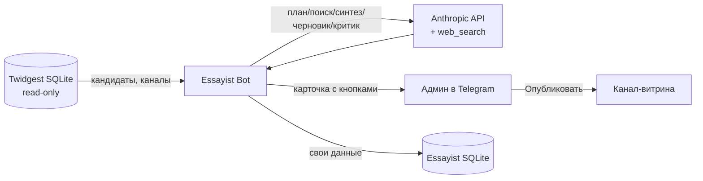

# Архитектура Essayist Bot

## Обзор и принцип изоляции

Essayist — отдельный бот и отдельный процесс, намеренно **не** встроенный в
Twidgest. Причина: Twidgest — это продакшн multi-tenant SaaS, обслуживающий
каналы клиентов. Essayist — экспериментальный инструмент для канала-витрины.
Их разделение означает: баг или перезапуск Essayist физически не может затронуть
автопубликацию Twidgest.

Связь между ними **односторонняя и только на чтение**: Essayist открывает базу
Twidgest в режиме `mode=ro` (read-only) и берёт оттуда твиты-кандидаты и
метаданные каналов. Записать в базу Twidgest он не может в принципе — даже при
баге попытка записи отклоняется SQLite.



## Модули

- **`essayist.py`** — движок. Одна точка входа `generate_essay(...) -> EssayResult`.
  Импортирует только `aiohttp`, не зависит ни от чего из Twidgest. Содержит
  HTTP-клиент Anthropic (ретраи на 408/429/5xx/529), системные промпты всех
  шагов и сам пайплайн.
- **`candidates.py`** — read-only доступ к базе Twidgest. `list_channels`,
  `top_candidates`, `top_candidate`, `get_by_tweet`, `get_channel`. Топ считается
  как `likes + retweets*3` — та же формула, что у viral_picker Twidgest.
- **`store.py`** — собственная SQLite. Класс `Store`: создание/чтение черновиков,
  статус-машина публикации, настройки таймера, флаги каналов, дедуп.
- **`bot.py`** — aiogram-приложение: команды `/essay` и `/timer`, обработчики
  кнопок, фоновый таймер автоподбора, регистрация команд в меню.

## Пайплайн генерации (essayist.py)

`generate_essay` выполняет 6 шагов + предохранитель:

1. **PLANNER** (быстрая модель) — по твиту формулирует 4–6 конкретных вопросов.
   Держит «сок» твита: ищет конкретный кейс/число/историю, ради которых им
   делятся, а не общую тему.
2. **SEARCHER** (быстрая модель, нативный `web_search`) — параллельно (семафор=2)
   отвечает на вопросы с веб-поиском, требует источник для каждого факта.
3. **Предохранитель** — если реальных веб-поисков было `0`
   (`usage.server_tool_use.web_search_requests`), генерация прерывается. Это не
   даёт выдать выдумку, когда поиск не сработал.
4. **SYNTHESIZER** (сильная модель) — сводит факты в проверенный бриф: выкидывает
   факты без источника и не по теме, помечает конфликты чисел, ничего не
   вычисляет сам.
5. **DRAFTER** (сильная модель) — пишет разбор. Твит = сигнал, не объект: пишем
   про новость за твитом, а не про сам твит. Запрещены вычисленные числа и
   кратности, обвинительный тон, имена частных лиц. Ядро — конкретный кейс.
   Длина параметризуется (`short` ≈ 900–1500 знаков для Telegram, `long`
   ≈ 3000–5000).
6. **CRITIC** (сильная модель) — фактчекер. Возвращает JSON со списком нарушений:
   `computed_number`, `fabricated_number` (оба — только если в цитате есть цифры),
   `time_mismatch`, `unflagged_conflict`, `off_topic`, `accusatory`,
   `private_name`. При вердикте `revise` запускается одна правка (REVISE).

`EssayResult(ok, brief, draft, violations, total_searches, error)` — результат.
`violations` показываются человеку в карточке как чек-лист.

### Эпистемика: TOPIC_UNVERIFIED и TOPIC_PARTIAL

SYNTHESIZER различает три исхода (правила в `SYNTHESIZER_SYSTEM`):
- предмет и утверждение подтверждены → обычный бриф;
- **TOPIC_PARTIAL**: именованная сущность НАЙДЕНА, но ключевое утверждение твита о ней
  не подтверждается → бриф подтверждённых фактов + строка `НЕ ПОДТВЕРЖДЕНО: <что>`.
  `generate_essay` срезает маркер и зовёт `_draft(partial=True)`: разбор по фактам с
  абзацем-границей знания, без слов «фейк/ложь/дезинформация»;
- **TOPIC_UNVERIFIED**: сама сущность/событие не находятся → честный отказ
  (перехват в `generate_essay`, разбор-опровержение не пишем — отсутствие
  подтверждения не доказательство несуществования).
Разграничение «предмет vs утверждение» прописано в промпте явно, с примером
(сущность найдена, свойство приписано → PARTIAL).

### Разделение моделей

Дешёвая модель (Haiku) — на планирование и поиск; сильная (Sonnet) — на синтез,
черновик, критик и правку. Снижает и стоимость, и нагрузку на rate-limit.
Имена моделей — из env (`ANTHROPIC_MODEL`, `ANTHROPIC_MODEL_FAST`).

## Поток HIL (bot.py)

Ручной путь (`/essay`) и автоматический (таймер) сходятся в одной карточке:

```
кандидат -> generate_essay -> store.create_draft (status=pending)
        -> черновик кусками + карточка с кнопками админу
```

Кнопки и переходы статусов:

- **Опубликовать**: `claim_for_publish` (атомарно `pending->publishing`) ->
  отправка в `target_chat_id` -> `finalize_publish` (`->published`, запись в
  аудит-лог). При ошибке отправки — `revert_publish` (`->pending`).
- **Сменить угол**: `begin_revision` (`->regenerating`, +1 к счётчику) ->
  повторный `generate_essay` -> `apply_revision` (`->pending`, новый текст).
- **Отклонить**: показывает причины -> `reject(reason)` (`->rejected`, причина
  записана).

## Схема собственной БД (store.py)

Таблица `pending_drafts` — основная:

```
id, channel_id, tweet_id, tweet_text, author, niche, target_chat_id, title,
brief, draft, violations_json, total_searches,
status,            -- pending | publishing | published | rejected | regenerating
revision_count, reject_reason,
published_message_id, published_at, created_at, decided_at
```

Таблицы настроек:

```
settings(key, value)                  -- напр. timer_hours
channel_flags(channel_id, enabled)    -- отключённые из автоподбора каналы
```

Аудит-лог `publish_log.jsonl` (append-only): по строке на публикацию с
`channel_id`, `tweet_id`, `message_id`, `ts`, `sender="essayist-bot"` — чтобы
отличать публикации Essayist от любых других.

## Механизмы безопасности

- **Read-only база Twidgest** — даже при баге Essayist не повредит данные клиентов.
- **Атомарный дедуп публикации** — `claim_for_publish` переводит
  `pending->publishing` ровно один раз; повторное/двойное нажатие «Опубликовать»
  получает `False` и ничего не отправляет. Не зависит от UI и невидимых меток.
- **Предохранитель веб-поиска** — 0 реальных поисков -> прерывание, без выдумки.
- **Критик-фактчекер** — ловит вычисленные/выдуманные числа, уход от темы,
  обвинительный тон, имена частных лиц.
- **HIL** — публикация только по явному нажатию человека. Автопостинга нет.
- **systemd анти-крашлуп** — `StartLimitBurst` не даёт сбойному процессу
  бесконечно перезапускаться и забивать журнал (урок реального инцидента).

## Дедупликация тем

- **Таймер**: пропускает любой твит, по которому уже создавался черновик
  (`seen_tweet`). Не спамит одной темой.
- **Ручной `/essay`**: прячет только **опубликованные** темы (`published_tweets`),
  чтобы отклонённую можно было пересмотреть. Режим `all` показывает всё.

Поведение намеренно разное: таймер не должен повторяться сам, человек вправе
вернуться к отвергнутой теме.

## Переменные окружения

| Переменная             | Назначение                                          |
|------------------------|-----------------------------------------------------|
| `TELEGRAM_BOT_TOKEN`   | токен второго бота (BotFather)                      |
| `ADMIN_USER_ID`        | Telegram ID владельца (единственный, кто управляет) |
| `TWIDGEST_DB`          | путь к SQLite Twidgest (read-only)                  |
| `ESSBOT_DB`            | путь к собственной SQLite                           |
| `ANTHROPIC_API_KEY`    | ключ Anthropic API                                  |
| `ANTHROPIC_MODEL`      | сильная модель (синтез/черновик/критик)             |
| `ANTHROPIC_MODEL_FAST` | дешёвая модель (план/поиск)                          |

## Точки расширения

- **Другие площадки** (vc.ru, Habr): добавить «publisher» за той же кнопкой
  «Опубликовать» через официальный API площадки (по токену). Веб-агент, кликающий
  по интерфейсу, не рекомендуется — хрупко и ломается об антибот.
- **Автопилот**: публиковать без человека только при пороге «критик: 0 нарушений
  И в брифе >= N фактов», иначе — на ручной просмотр. Включать только по данным
  статистики «принято/отклонено».

## Квоты и биллинг (этап D, июнь 2026)

Самообслуживание, в личку владельцу ходить не нужно:
- **Авто-триал**: `store.ensure_trial(uid)` на первом /start (и сам факт строки в
  `essayist_users` = триал использован, повторного нет). Триал: 7 дней И 20 разборов.
- **Планы** (`essayist_users.plan`): `trial` (20), `paid` (20), `manual` (выдан руками
  через /grant — без квоты). Квоты — `Store.PLAN_QUOTA`.
- **Списание**: `_quota_take(uid)` в bot.py ПЕРЕД каждой из 4 точек генерации
  (своя тема, выбор кандидата, «сменить угол», таймер); при `res.ok == False` —
  `refund_essay` (неудачные не считаются). Суперадмин мимо квоты.
- **Оплата**: кнопка `esbuy` → Stars-инвойс `essayist:30d` на `PRICE_STARS_ESSAY=1490`
  → `activate_paid`: +30 дней от конца текущего срока, план `paid`, счётчик в 0.
- Правило: «1 успешная генерация = 1 разбор», включая «Сменить угол».

## Учёт себестоимости (/costs)

- `_Anthropic` копит `usage_in/usage_out` со всех вызовов (`_track` в call/search);
  `generate_essay` вшивает суммы трёх клиентов в `EssayResult.tokens_in/out`
  через замыкание `_res` (все 7 return-точек).
- Каждая генерация (и неудачная) пишется в `essay_costs`
  (channel_id, user_id, ok, searches, tokens_in/out, created_at).
- `/costs [days]` (админ): агрегат по каналам + USD-оценка по константам
  `COST_*` в bot.py (верхняя: все токены по цене основной модели) и проекция
  «себестоимость квоты 20 против 1490⭐». Константы цен сверять с прайсом Anthropic.

## Известные ограничения

- На «своей теме» (`/essay <id> <текст>`) бот наполнит фактурой заданную рамку,
  даже если она спорная — проверка человеком тут особенно важна.
- Ссылка на твит без доступа к Twitter API уходит в веб-поиск как зацепка;
  вставленный текст твита/новости даёт лучший результат.
- Критик не идеален: возможны и пропуски, и ложные срабатывания. Поэтому HIL.
